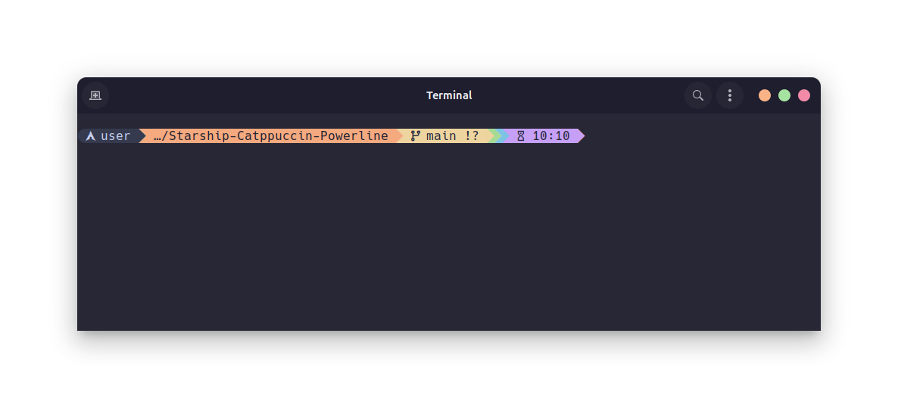

<h3 align="center">
	
	 
	 
	Catppuccin for <a href="https://starship.rs">Starship</a>
</h3>

	

## ❗ Prerequisites

- A [Nerd Font](https://www.nerdfonts.com/) installed and enabled in your terminal (the example uses Hack Nerd Font)

## 💻 Usage

1. Find (or create) your `starship.toml` to paste into
   - Typically at `~/.config/starship.toml`
2. Set your `palette = "catppuccin_flavor"` value, save and quit!

3. To apply the changes in VS Code terminal, make sure you add `"terminal.integrated.fontFamily": "Your_Nerd_Font",`
   in the `settings.json` file

## ✨ Inspired by

- [Pastel Powerline](https://starship.rs/presets/pastel-powerline)
- [Gruvbox Rainbow](https://starship.rs/presets/gruvbox-rainbow)

## 💜 Thanks to

- [catppuccin](https://github.com/catppuccin)
- [typecraft-dev](https://github.com/typecraft-dev)
- [Chamal1120](https://github.com/Chamal1120)

&nbsp;

	

